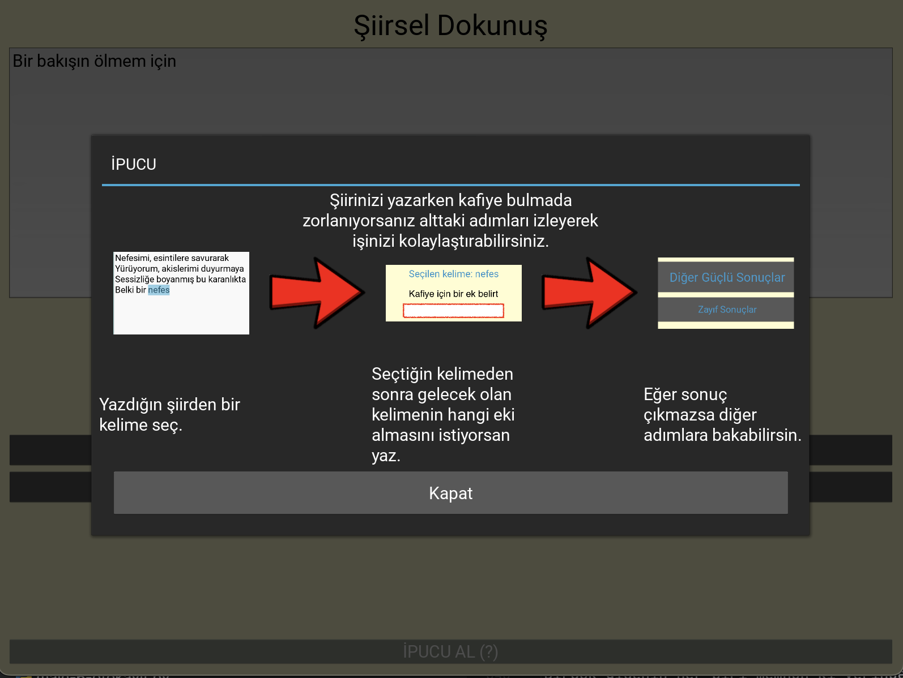

# Sairin-kelimeleri-uygulamasi
Bu uygulama şiir yazarken türkçe kelimeleri doğru bir biçimde kullanmaya yardım eder. Daha önce yazılmış olan şiirlerin cümlelerinde kelimelerin birbiriyle olan ilişkisine bakar.

